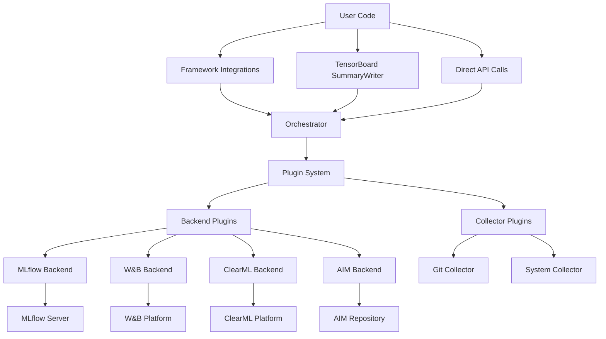

# Architecture Overview

This document provides a detailed overview of Tracelet's architecture for developers and contributors.

## High-Level Architecture



## Core Components

### 1. Orchestrator (`tracelet.core.orchestrator`)

The **Orchestrator** is the central component that coordinates all metric flow and routing.

**Key Responsibilities:**

- Receives metrics from various sources (TensorBoard, Lightning, direct API)
- Routes metrics to appropriate backends based on configuration
- Manages thread-safe operations and queueing
- Handles backpressure and error recovery

**Architecture:**

```python
class Orchestrator:
    def __init__(self):
        self._backends: List[BackendInterface] = []
        self._collectors: List[CollectorInterface] = []
        self._queue: Queue = Queue()
        self._worker_threads: List[Thread] = []
        self._running: bool = False

    def route_metric(self, metric: Metric) -> None:
        """Route metric to all configured backends"""

    def start(self) -> None:
        """Start worker threads and collectors"""

    def stop(self) -> None:
        """Stop all operations gracefully"""
```

### 2. Plugin System (`tracelet.core.plugins`)

The **Plugin System** provides a modular architecture for extending Tracelet.

**Plugin Types:**

- **Backend Plugins**: Implement experiment tracking backends
- **Framework Plugins**: Integrate with ML frameworks
- **Collector Plugins**: Gather environment and system data

**Plugin Interface:**

```python
class PluginInterface:
    @classmethod
    def get_metadata(cls) -> PluginMetadata:
        """Return plugin metadata"""

    def initialize(self, config: dict) -> None:
        """Initialize plugin with configuration"""

    def cleanup(self) -> None:
        """Clean up resources"""

class BackendPlugin(PluginInterface):
    def create_backend(self, config: dict) -> BackendInterface:
        """Factory method to create backend instance"""

class FrameworkPlugin(PluginInterface):
    def patch_framework(self, orchestrator: Orchestrator) -> None:
        """Patch framework to capture metrics"""
```

### 3. Experiment Management (`tracelet.core.experiment`)

The **Experiment** class provides the main API for interacting with Tracelet.

**Key Features:**

- Unified API across all backends
- Parameter and metric logging
- Artifact management
- Context management

```python
class Experiment:
    def __init__(self, name: str, project: str):
        self.name = name
        self.project = project
        self._orchestrator = Orchestrator()

    def log_metric(self, name: str, value: float, step: int = None) -> None:
        """Log a scalar metric"""

    def log_params(self, params: dict) -> None:
        """Log experiment parameters"""

    def log_artifact(self, artifact_path: str) -> None:
        """Log an artifact file"""
```

## Framework Integrations

### TensorBoard Integration (`tracelet.frameworks.pytorch`)

**Method**: Monkey patching `torch.utils.tensorboard.SummaryWriter`

**Implementation Strategy:**

1. Store original methods
2. Wrap methods with metric capture
3. Forward calls to original methods
4. Send captured metrics to orchestrator

```python
class PyTorchFramework:
    def __init__(self):
        self._original_methods = {}
        self._patched = False

    def _patch_tensorboard(self):
        """Patch TensorBoard SummaryWriter methods"""
        from torch.utils.tensorboard import SummaryWriter

        # Store original method
        self._original_methods['add_scalar'] = SummaryWriter.add_scalar

        # Create wrapped method
        def wrapped_add_scalar(self, tag, scalar_value, global_step=None, walltime=None):
            # Capture metric
            self._orchestrator.route_metric(Metric(tag, scalar_value, global_step))

            # Call original method
            return self._original_methods['add_scalar'](self, tag, scalar_value, global_step, walltime)

        # Apply patch
        SummaryWriter.add_scalar = wrapped_add_scalar
```

### PyTorch Lightning Integration (`tracelet.frameworks.lightning`)

**Method**: Monkey patching `pytorch_lightning.LightningModule.log`

**Implementation Strategy:**

1. Patch the `log` method of LightningModule
2. Intercept all `self.log()` calls
3. Extract metric information and route to orchestrator
4. Preserve original Lightning logging behavior

```python
class LightningFramework:
    def _patch_lightning_logging(self):
        """Patch Lightning's logging system"""
        from pytorch_lightning.core.module import LightningModule

        # Store original method
        self._original_log = LightningModule.log

        def wrapped_log(module_self, name: str, value, *args, **kwargs):
            # Call original method first
            result = self._original_log(module_self, name, value, *args, **kwargs)

            # Extract step information
            step = self._get_current_step(module_self)

            # Route to Tracelet
            if isinstance(value, (int, float)):
                self._orchestrator.route_metric(Metric(name, float(value), step))

            return result

        # Apply patch
        LightningModule.log = wrapped_log
```

## Backend Implementations

### Backend Interface

All backends implement a common interface:

```python
class BackendInterface:
    def log_metric(self, name: str, value: float, step: int) -> None:
        """Log a scalar metric"""

    def log_params(self, params: dict) -> None:
        """Log experiment parameters"""

    def log_artifact(self, artifact_path: str, artifact_name: str = None) -> None:
        """Log an artifact"""

    def start_experiment(self, name: str, project: str) -> str:
        """Start a new experiment, return experiment ID"""

    def end_experiment(self) -> None:
        """End the current experiment"""
```

### MLflow Backend (`tracelet.backends.mlflow`)

**Implementation Details:**

- Uses `mlflow.tracking` client
- Manages MLflow runs automatically
- Supports local and remote tracking servers
- Handles nested runs for complex experiments

```python
class MLflowBackend(BackendInterface):
    def __init__(self, config: dict):
        import mlflow
        self.mlflow = mlflow
        self.tracking_uri = config.get('tracking_uri', 'file:./mlruns')
        self.mlflow.set_tracking_uri(self.tracking_uri)

    def start_experiment(self, name: str, project: str) -> str:
        experiment = self.mlflow.set_experiment(project)
        run = self.mlflow.start_run(run_name=name)
        return run.info.run_id
```

### W&B Backend (`tracelet.backends.wandb`)

**Implementation Details:**

- Uses `wandb` Python SDK
- Manages wandb runs and projects
- Supports both cloud and local modes
- Handles W&B-specific features (sweeps, artifacts)

### ClearML Backend (`tracelet.backends.clearml`)

**Implementation Details:**

- Uses `clearml` SDK
- Manages ClearML tasks and projects
- Supports offline mode for testing
- Integrates with ClearML's experiment management

## Data Flow

### Metric Flow Pipeline

1. **Capture**: Framework integrations capture metrics from user code
2. **Queue**: Metrics are queued for processing to handle high-frequency logging
3. **Route**: Orchestrator routes metrics to all configured backends
4. **Transform**: Each backend transforms metrics to its native format
5. **Send**: Backends send metrics to their respective platforms

```python
# Example metric flow
def metric_flow_example():
    # 1. User code logs metric
    writer.add_scalar('accuracy', 0.95, step=100)

    # 2. TensorBoard patch captures metric
    metric = Metric(name='accuracy', value=0.95, step=100)

    # 3. Orchestrator queues metric
    orchestrator.route_metric(metric)

    # 4. Worker thread processes queue
    for backend in backends:
        backend.log_metric(metric.name, metric.value, metric.step)

    # 5. Backends send to their platforms
    # MLflow: mlflow.log_metric('accuracy', 0.95, step=100)
    # W&B: wandb.log({'accuracy': 0.95}, step=100)
    # ClearML: logger.report_scalar('accuracy', 'accuracy', 0.95, 100)
```

### Threading Model

**Main Thread**: User code execution and framework patching
**Worker Threads**: Background processing of metric queue
**Collector Threads**: Periodic collection of system metrics

```python
class ThreadingModel:
    def __init__(self):
        self._metric_queue = Queue()
        self._worker_pool = ThreadPoolExecutor(max_workers=4)
        self._collector_timer = Timer(interval=30.0, function=self._collect_metrics)

    def _process_metrics(self):
        """Worker thread processes metric queue"""
        while self._running:
            try:
                metric = self._metric_queue.get(timeout=1.0)
                self._route_to_backends(metric)
            except Empty:
                continue

    def _collect_metrics(self):
        """Periodic collection of system metrics"""
        for collector in self._collectors:
            metrics = collector.collect()
            for metric in metrics:
                self._metric_queue.put(metric)
```

## Configuration Management

### Configuration Hierarchy

1. **Default Configuration**: Built-in defaults
2. **Environment Variables**: System-wide overrides
3. **Configuration Files**: Project-specific settings
4. **API Parameters**: Runtime overrides

```python
class ConfigurationManager:
    def __init__(self):
        self.config = self._load_default_config()
        self._apply_env_overrides()
        self._load_config_files()

    def _load_default_config(self) -> dict:
        return {
            'backends': ['mlflow'],
            'track_system': True,
            'track_git': True,
            'metrics_interval': 30.0,
            'max_queue_size': 10000
        }
```

### Settings Management (`tracelet.settings`)

**Pydantic-based Settings:**

- Type validation
- Environment variable integration
- Documentation generation
- IDE support

```python
from pydantic import BaseSettings

class TraceletSettings(BaseSettings):
    project: str = "default"
    backend: List[str] = ["mlflow"]
    track_system: bool = True
    track_git: bool = True
    track_env: bool = True
    metrics_interval: float = 30.0

    class Config:
        env_prefix = "TRACELET_"
        case_sensitive = False
```

## Error Handling and Recovery

### Error Strategies

**Graceful Degradation**: Continue operation even if some backends fail
**Retry Logic**: Automatic retry with exponential backoff
**Circuit Breaker**: Temporarily disable failing backends
**Fallback Modes**: Switch to local backends if remote ones fail

```python
class ErrorHandling:
    def __init__(self):
        self._retry_config = {
            'max_retries': 3,
            'backoff_factor': 2.0,
            'max_backoff': 60.0
        }
        self._circuit_breakers = {}

    async def safe_backend_call(self, backend: BackendInterface, operation: str, *args, **kwargs):
        """Safely call backend with error handling"""
        breaker = self._circuit_breakers.get(backend.name)

        if breaker and breaker.is_open():
            return None  # Skip if circuit breaker is open

        try:
            method = getattr(backend, operation)
            return await method(*args, **kwargs)
        except Exception as e:
            self._handle_backend_error(backend, e)
            return None
```

## Performance Considerations

### Optimization Strategies

**Batching**: Batch multiple metrics for efficient network usage
**Compression**: Compress large artifacts and images
**Async Operations**: Non-blocking metric logging
**Connection Pooling**: Reuse connections to backend services

### Memory Management

**Bounded Queues**: Prevent memory leaks from unbounded growth
**Periodic Cleanup**: Clean up completed experiments
**Resource Limits**: Configurable limits on image sizes and queue sizes

### Profiling and Monitoring

**Internal Metrics**: Track Tracelet's own performance
**Debugging Tools**: Built-in profiling and debugging capabilities
**Health Checks**: Monitor backend connectivity and health

## Security Considerations

### API Key Management

- Environment variable storage
- Secure credential storage
- Key rotation support
- Minimal privilege access

### Data Privacy

- Configurable data filtering
- PII detection and masking
- Local-only modes for sensitive data
- Audit logging capabilities

## Extension Points

### Custom Backends

Developers can create custom backends by:

1. Implementing `BackendInterface`
2. Creating a backend plugin
3. Registering the plugin with Tracelet

### Custom Collectors

Add new data collectors by:

1. Implementing `CollectorInterface`
2. Creating a collector plugin
3. Configuring collection intervals

### Custom Framework Integrations

Integrate new frameworks by:

1. Implementing `FrameworkInterface`
2. Creating framework-specific patches
3. Testing with framework workflows

This architecture provides a solid foundation for experiment tracking while remaining flexible and extensible for future enhancements.
