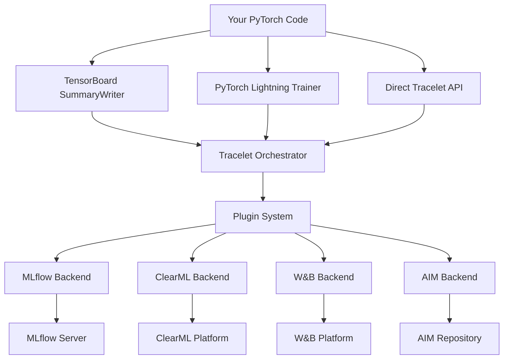

# Tracelet

<div align="center">
  

**Intelligent experiment tracking for PyTorch and PyTorch Lightning**

_Automagic metric capture and multi-backend logging_

[](https://github.com/prassanna-ravishankar/tracelet/releases)
[](https://github.com/prassanna-ravishankar/tracelet/actions/workflows/main.yml?query=branch%3Amain)
[](https://pypi.org/project/tracelet)
[](https://pypi.org/project/tracelet)
[](https://github.com/prassanna-ravishankar/tracelet/blob/main/LICENSE)
[](https://github.com/prassanna-ravishankar/tracelet/graphs/commit-activity)

</div>

## What is Tracelet?

Tracelet is a powerful Python library that automatically captures and logs your machine learning experiments without requiring code modifications. Simply add one line to start tracking, and Tracelet will:

- 🔍 **Automatically capture** TensorBoard metrics, PyTorch Lightning logs, and system metrics
- 🔄 **Route to multiple backends** simultaneously (MLflow, ClearML, W&B, AIM)
- 📊 **Track everything** - scalars, histograms, images, audio, text, and artifacts
- ⚡ **Zero code changes** required for existing TensorBoard workflows
- 🎯 **Plugin architecture** for extensible functionality

## Quick Start

### Installation

=== "pip"
`bash
    pip install tracelet
    `

=== "uv"
`bash
    uv add tracelet
    `

=== "conda"
`bash
    conda install -c conda-forge tracelet
    `

### Basic Usage

```python
import tracelet
import torch
from torch.utils.tensorboard import SummaryWriter

# 1. Start tracking (one line!)
tracelet.start_logging(
    exp_name="my_experiment",
    project="my_project",
    backend="mlflow"  # or "clearml", "wandb", "aim"
)

# 2. Use TensorBoard as normal - metrics automatically captured
writer = SummaryWriter()
for epoch in range(100):
    loss = train_one_epoch()  # Your existing training code
    writer.add_scalar('Loss/train', loss, epoch)
    # ✨ Metrics automatically sent to MLflow!

# 3. Stop tracking
tracelet.stop_logging()
```

!!! success "That's it!"
Your existing TensorBoard code now logs to MLflow, ClearML, W&B, or AIM with zero changes!

## Key Features

### 🔌 Multi-Backend Support

Choose from 4 popular experiment tracking backends:

- **[MLflow](backends/mlflow.md)** - Open source ML lifecycle management
- **[ClearML](backends/clearml.md)** - Enterprise-grade MLOps platform
- **[Weights & Biases](backends/wandb.md)** - Collaborative ML platform
- **[AIM](backends/aim.md)** - Open source experiment tracking

### 🎯 Automatic Instrumentation

Tracelet automatically captures:

- **TensorBoard metrics** - Scalars, histograms, images, audio, text
- **PyTorch Lightning** - Training/validation metrics, hyperparameters
- **System metrics** - CPU, memory, GPU usage
- **Git information** - Repository state, commit hash, branch
- **Environment** - Python version, package versions, hardware info

### 📊 Rich Data Types

Log and visualize various data types:

- **Scalars** - Loss curves, accuracy, learning rates
- **Histograms** - Weight distributions, gradients
- **Images** - Sample predictions, confusion matrices
- **Audio** - Speech samples, music generation
- **Text** - Training summaries, generated text
- **Artifacts** - Models, datasets, configuration files

### ⚡ Performance Optimized

- **Thread-safe** orchestrator for concurrent logging
- **Batched operations** to minimize overhead
- **Smart buffering** for high-throughput scenarios
- **Configurable routing** for different metric types

## Architecture Overview



## Why Tracelet?

### Before Tracelet 😤

```python
# Different APIs for each backend
import mlflow
import wandb
from clearml import Task

# Separate logging calls
mlflow.log_metric("loss", loss)
wandb.log({"loss": loss})
Task.current_task().logger.report_scalar("loss", loss)

# Manual setup for each backend
mlflow.start_run()
wandb.init(project="my-project")
task = Task.init(project_name="my-project")
```

### With Tracelet 🎉

```python
# One API, any backend
import tracelet

tracelet.start_logging(backend="mlflow")  # or any backend
writer.add_scalar("loss", loss)  # Works everywhere!
```

## What's Next?

<div class="grid cards" markdown>

- :material-rocket-launch: **[Quick Start Guide](quick-start.md)**

  ***

  Get up and running in under 5 minutes with your first experiment

- :material-cog: **[Installation Guide](installation.md)**

  ***

  Detailed installation instructions for all backends and environments

- :material-api: **[API Reference](api/core.md)**

  ***

  Complete API documentation with examples and type hints

- :material-book-open: **[Examples](examples/basic.md)**

  ***

  Real-world examples and Jupyter notebooks to learn from

</div>

## Community & Support

- 📚 **[Documentation](https://prassanna-ravishankar.github.io/tracelet)** - Comprehensive guides and API docs
- 🐛 **[Issues](https://github.com/prassanna-ravishankar/tracelet/issues)** - Bug reports and feature requests
- 💬 **[Discussions](https://github.com/prassanna-ravishankar/tracelet/discussions)** - Questions and community support
- 📧 **[Email](mailto:me@prassanna.io)** - Direct contact with maintainers

## License

Tracelet is released under the [MIT License](https://github.com/prassanna-ravishankar/tracelet/blob/main/LICENSE).

---

<div align="center">
  <strong>Ready to supercharge your ML experiments?</strong><br>
  <a href="quick-start.md" class="md-button md-button--primary">Get Started</a>
  <a href="https://github.com/prassanna-ravishankar/tracelet" class="md-button">View on GitHub</a>
</div>
